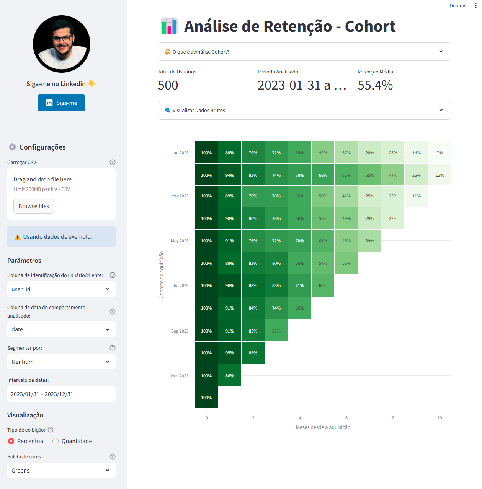

# 📊 Análise de Retenção com Cohort

Este projeto apresenta uma ferramenta interativa desenvolvida com Python e Streamlit para realizar a Análise Cohort, permitindo a visualização clara e detalhada da retenção de usuários ao longo do tempo.



## 💡 O que é a Análise Cohort?
A Análise Cohort agrupa usuários que compartilham uma característica comum (por exemplo, data de cadastro ou campanha de marketing) para acompanhar seu comportamento ao longo do tempo, permitindo identificar padrões de retenção e engajamento.

## 🚀 Funcionalidades
- **Upload de Dados**: Carregue facilmente arquivos CSV personalizados ou utilize dados sintéticos disponibilizados como exemplo.
- **Segmentação Inteligente**: Opções automáticas para seleção de colunas de identificação de usuários, datas e segmentações por categoria.
- **Visualização Interativa**: Heatmaps interativos usando Plotly para explorar retenção em valores absolutos ou percentuais.
- **Personalização**: Escolha entre diversas paletas de cores e parâmetros configuráveis diretamente na interface intuitiva.
- **Informações Rápidas**: Métricas essenciais como total de usuários, período analisado e retenção média imediatamente disponíveis.

## 🛠️ Tecnologias Utilizadas
- **Python**: Pandas, NumPy
- **Streamlit**: Interface gráfica interativa
- **Plotly**: Visualização dinâmica e interativa de dados

## 🧑‍💻 Como utilizar?
1. Clone ou baixe o repositório.
2. Instale as dependências necessárias:
```bash
pip install streamlit pandas numpy plotly
```
3. Execute a aplicação localmente:
```bash
streamlit run app.py
```

## 📌 Aplicações
- Avaliação de campanhas de marketing
- Análise da retenção de usuários
- Otimização da experiência do usuário (UX)
- Redução do churn

## 🤝 Contribuições
Contribuições são sempre bem-vindas! Fique à vontade para abrir issues, sugerir melhorias ou enviar pull requests.

## 🔗 Conecte-se comigo
- [Meu LinkedIn](https://linkedin.com/comm/mynetwork/discovery-see-all?usecase=PEOPLE_FOLLOWS&followMember=brunoarandati)

---

Desenvolvido com ❤️ por Bruno Moraes Aranda.